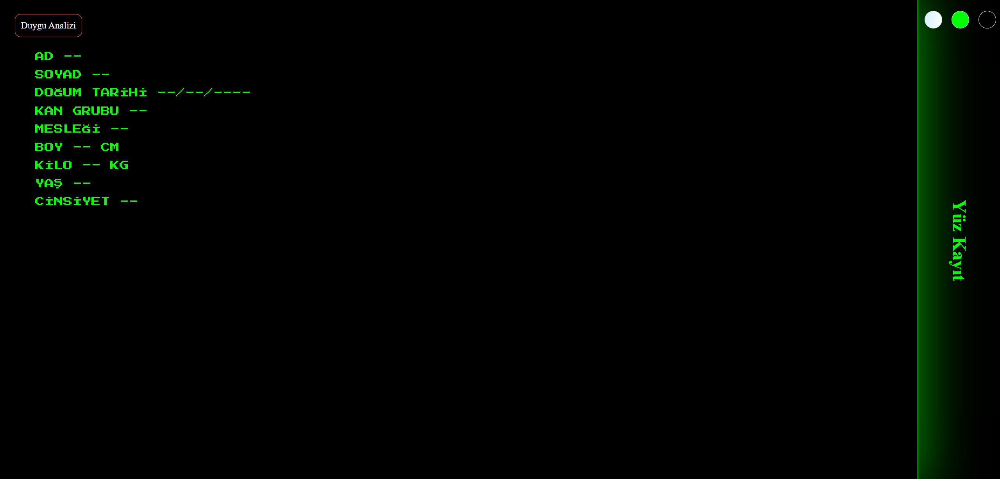
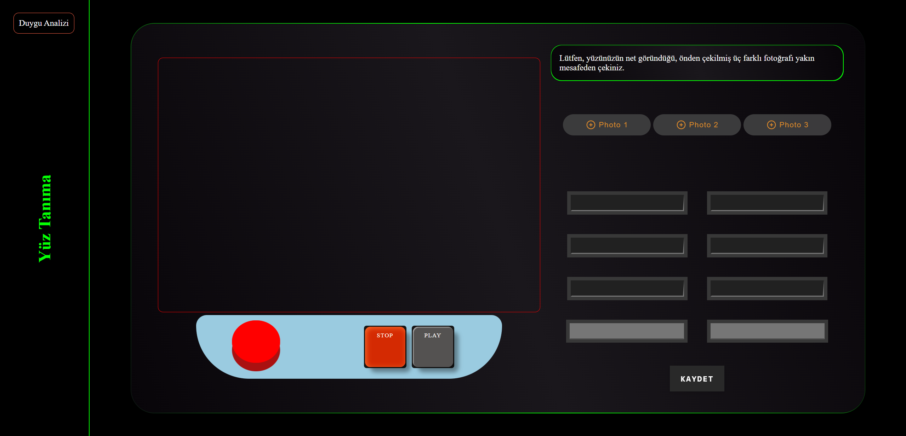
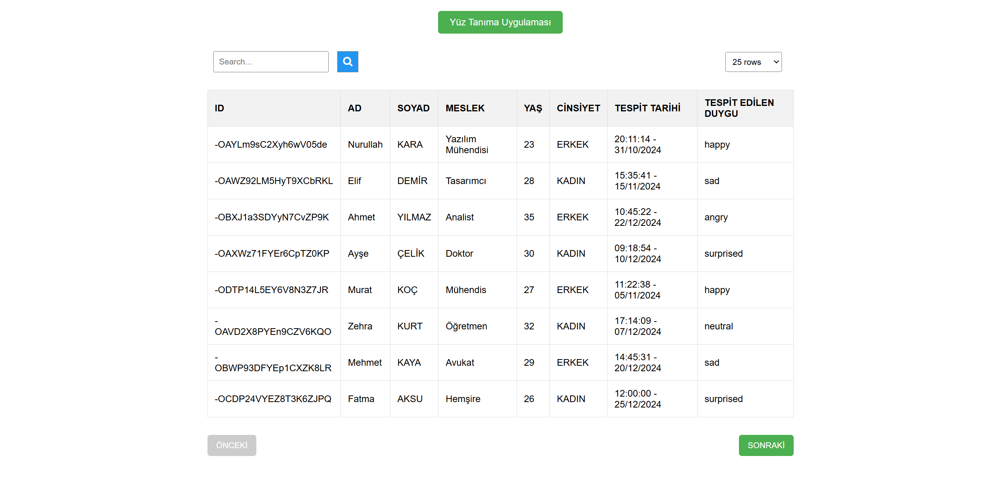

# Yüz ve Duygu Tanıma Web Uygulaması

## Genel Bakış

Bu proje, gerçek zamanlı yüz tanıma ve duygu analizi yapan Django tabanlı bir web uygulamasıdır. Uygulama, veri saklama için Firebase'i entegre eder, duygu analizi için `deepface` kütüphanesini kullanır ve hassas yüz tanıma için özel bir Transfer Learning modeli kullanır. Kullanıcılar, yüz tanıma için maksimum 3 fotoğraf kaydedebilir ve duygu analizi yapılan kişilerin detaylarını gösteren ayrı bir web sayfasına erişebilir.

---

## Özellikler

- **Yüz Tanıma**: Özel olarak geliştirilmiş Transfer Learning modeli kullanılarak kayıtlı yüzleri doğru şekilde tanır.
- **Duygu Analizi**: Tanınan yüzlerden `deepface` kütüphanesi ile duygu analizi yapar.
- **Kullanıcı Kaydı**: Kişi başına 3 fotoğrafa kadar kayıt yapılmasına izin verir.
- **Duygu Geçmişi Sayfası**: Duygu analizi yapılan kişilerin detaylı listesini görüntüler.
- **Firebase Entegrasyonu**: Kullanıcı verilerini ve resim metaverilerini güvenli bir şekilde Firebase'de saklar.
- **Model Performans Paneli**: Doğruluk, kayıp ve karmaşıklık matrisi gibi performans metrikleri GitHub'da görüntülenebilir.

---

## Teknoloji Yığını

- **Backend**: Django (Python)
- **Frontend**: HTML, CSS, JavaScript (Bootstrap ile tasarım)
- **Veritabanı**: Firebase
- **Kütüphaneler**:
  - `deepface` (duygu analizi için)
  - TensorFlow/Keras (Transfer Learning için)

---

## Kurulum

### Gereksinimler

- Python 3.8+
- Firebase hesabı
- Kodların çalışacağı ortam

### Kurulum Adımları

1. **Depoyu Klonlayın**:

   ```bash
   git clone https://github.com/senin-repo/yuz-ve-duygu-analizi.git
   cd yuz-ve-duygu-analizi
   ```

2. **Sanal Ortamı Oluşturun**:

   ```bash
   python -m venv venv
   source venv/bin/activate # Linux/Mac
   venv\Scripts\activate.bat   # Windows
   ```

3. **Bağımlılıkları Yükleyin**:

   ```bash
   pip install -r requirements.txt
   ```

4. **Firebase Yapılandırması**:

   - Firebase kimlik bilgilerinizi projeye ekleyin.
   - Firebaseden alınan private key'e "credentials.json" ismini verin.
   - `credentials.json` dosyasını proje kök dizinine yerleştirin.

5. **Veritabanı Migrasyonlarını Çalıştırın**:

   ```bash
   python manage.py makemigrations
   python manage.py migrate
   ```

6. **Sunucuyu Başlatın**:

   ```bash
   python manage.py runserver
   ```

   Uygulamaya `http://127.0.0.1:8000/face/Processing/` adresinden erişebilirsiniz.

---

## Kullanım

1. **Fotoğrafları Kaydedin**:

   - Kayıt sayfasına gidin.
   - Her kişi için maksimum 3 fotoğraf yükleyin.

2. **Yüz Tanıma ve Duygu Analizi Yapın**:

   - Yüz tanıma sayfasına gidin.
   - Tanınmasını istediğiniz kişiyi kameraya gösterin.
   - Tanınan yüzün ve buna karşılık gelen duygunun sonucunu görüntüleyin.

3. **Duygu Geçmişi Sayfası**:

   - "Duygu Analizi Geçmişi" sayfasına giderek duygu analizi yapılan kişilerin listesini inceleyin.

---

## Özel Yüz Tanıma Modeli

### Genel Bakış

Yüz tanıma özelliği, etiketlenmiş yüzlerden oluşan bir veri setinde eğitilen özel bir Transfer Learning modeli kullanır. Bu model, önceden eğitilmiş ağırlıklardan yararlanarak doğruluğu artırır ve eğitim sürecini kısaltır.

### Model Mimarisi

- **Temel Model**: ResNet50 (ImageNet ağırlıkları ile)
- **Özel Katmanlar**:
  - Flatten katmanı
  - ReLU aktivasyonlu Yoğun katman
  - Dropout katmanı (0.5)
  - Softmax aktivasyonlu çıkış katmanı (sınıf sayısı kadar)

### Performans Ölçütleri

- **Doğruluk**: Test veri setinde %--
- **Kayıp**: --
- **Karmaşıklık Matrisi**:

  

- **ROC Eğrisi**:

  

### Eğitim Detayları

- **Optimizasyon**: --
- **Öğrenme Oranı**: --
- **Batch Boyutu**: --
- **Epok Sayısı**: --
- **Veri Seti**: 198.000+ etiketlenmiş görüntüdün oluşturduğu özel veri seti

### Veri Seti Link

Modelin eğitimi için kullanılan veri setinin ham haline [buradan](https://drive.google.com/drive/folders/1-4d9zqiOTOEYmi-98AQiFM3TH7ae6zFZ?usp=sharing), ön işlem görmüş son haline [buradan](https://drive.google.com/drive/folders/1D8rRwJJRgXBaBn9jvKipwAaQBp-t9goO?usp=sharing) erişebilirsiniz.

---

## Ekran Görüntüleri

### Ana Sayfa


### Yüz Tanıma Ve Duygu Analizi Sayfası



### Yüz Kayıt Sayfası



### Duygu Analizi Geçmişi



---

## Lisans

Bu proje MIT Lisansı altında lisanslanmıştır. Detaylar için [LICENSE](LICENSE) dosyasına bakın.

---

## İletişim

Sorularınız veya katkılarınız için iletişime geçin:

- E-posta: [nurullahkarailetisim@gmail.com](mailto:nurullahkarailetisim@gmail.com)
- GitHub: [Nurullah KARA](https://github.com/hypynnax)
